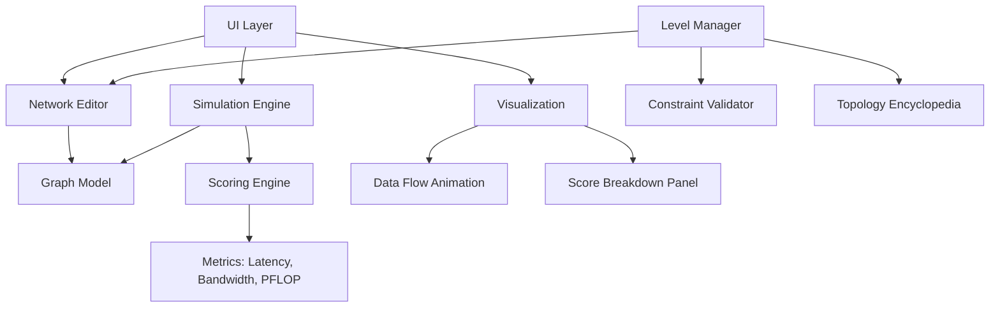

# Datacenter Network Gamification Project

Build a browser-based gamified datacenter network designer with progressive difficulty levels, all-reduce workload simulation, animated data flow visualization, and an accompanying academic paper analyzing network topology theory.

## Architecture Overview

A single-page browser app (vanilla HTML/CSS/JS, no build step) with a simulation engine, progressive levels, and a companion academic paper.

## Core Components

### 1. Graph Model
- Nodes: position (x,y or x,y,z), compute capacity (FLOPS), memory
- Edges: bandwidth (Gbps), latency (ns), cable length
- Adjacency list representation with methods for shortest path, diameter, bisection bandwidth, planarity check

### 2. Network Editor (UI)
- **2D mode** (early levels): Fixed grid positions, click-to-connect nodes
- **2D free mode** (mid levels): Drag nodes, draw edges
- **3D mode** (late levels): Three.js scene, orbit controls, 3D node placement and edge drawing
- Visual feedback: constraint violations shown in real-time (red highlights for too-long cables, warnings for exceeding connection limits)

### 3. Simulation Engine (Packet-Level Discrete-Event Simulation)
The all-reduce operation requires every node to share its local gradient with all other nodes. The simulation models this at packet granularity using a deterministic discrete-event simulation (DES):

- **Event-driven architecture**: a priority queue of events (packet arrivals, transmissions, queue drains) processed in simulated-time order -- no wall-clock dependency, so results are identical across all platforms
- **Seeded PRNG**: all randomness (workload distribution, tie-breaking) uses a seeded pseudorandom number generator for reproducible, consistent scoring
- **Congestion and queuing**: each link has a finite bandwidth and propagation delay; packets queue at saturated links, producing realistic contention effects
- **Communication strategies**: the engine evaluates ring all-reduce and tree all-reduce patterns for the player's topology and scores using the better result
- **PFLOP score**: `(total_compute_FLOPS) / (compute_time + communication_time)` -- communication time is derived from the DES, capturing congestion effects that aggregate models miss

### 4. Scoring and Breakdown
After the player submits their design:
1. **Animated simulation**: data packets (colored dots) flow through the network showing the all-reduce pattern, highlighting bottlenecks in red
2. **Score breakdown panel**:
   - Effective PFLOPS (the headline number)
   - Communication overhead (% of time spent on data transfer vs. compute)
   - Network diameter (longest shortest path)
   - Bisection bandwidth
   - Bottleneck link identification
   - Cable cost / budget utilization
3. **Star rating**: 1-3 stars based on how close to the theoretical optimum for that level's constraints

### 5. Level Progression (6-10 levels)

| Level | Nodes | View | New Constraint | Topology Unlock |
|-------|-------|------|----------------|-----------------|
| 1 | 4 | 2D fixed | None (tutorial) | -- |
| 2 | 6 | 2D fixed | Max connections per node | Ring |
| 3 | 8 | 2D fixed | Cable length limit | Mesh |
| 4 | 10 | 2D free | Total cable budget | Torus |
| 5 | 12 | 2D free | Planarity required | Hypercube |
| 6 | 16 | 2D free | Max degree + budget | Fat-tree |
| 7 | 20 | 3D | Cable length in 3D | Dragonfly |
| 8 | 25 | 3D | All constraints active | Clos network |

(Exact numbers are flexible -- the key is the ramp from simple to complex.)

### 6. Topology Encyclopedia
Unlocked entries after completing each level. Each entry covers:
- Diagram of the topology
- Real-world usage (e.g., "Fat-trees are used in Google's Jupiter fabric")
- Graph-theoretic properties (degree, diameter, bisection bandwidth)
- How the player's best design for that level compares

## Constraint System

Constraints are validated in real-time as the player edits:
- **Max degree**: limit on connections per node
- **Max cable length**: Euclidean distance limit between connected nodes
- **Total cable budget**: sum of all cable lengths cannot exceed a cap
- **Planarity**: the graph must be planar (embeddable without crossings) -- checked via a planarity testing algorithm (e.g., Boyer-Myrvold)
- **Bandwidth budget**: total bandwidth across all links is capped

## Tech Stack

- **HTML/CSS/JS** -- no framework, no build step, just open `index.html`
- **Canvas 2D** for early levels
- **Three.js** (CDN) for 3D levels
- **No backend** -- all simulation runs client-side
- File structure:
  - `index.html` -- entry point
  - `css/` -- styles
  - `js/engine/` -- graph model, simulation, scoring
  - `js/ui/` -- editor, visualization, level manager
  - `js/levels/` -- level definitions (JSON-like configs)
  - `js/encyclopedia/` -- topology data and comparisons
  - `assets/` -- any icons or images

## Academic Paper Outline

1. **Introduction**: The role of network topology in datacenter performance
2. **Background**: Graph theory fundamentals (degree, diameter, bisection bandwidth, planarity); real datacenter topologies (fat-tree, Clos, dragonfly, torus)
3. **System Design**: The gamification model, simulation engine, scoring formula
4. **Analysis**: How different topologies perform under the all-reduce workload; theoretical bounds vs. player-achievable scores
5. **Results**: Example gameplay data, comparison of player designs vs. known optimal topologies
6. **Discussion**: What the game teaches about network design trade-offs; limitations of the simplified model
7. **Conclusion**

## Implementation Phases

### Phase 1 -- Core Engine
- Graph data structure with node/edge management
- Shortest path (Dijkstra/BFS), diameter, bisection bandwidth calculations
- Packet-level discrete-event simulation engine (event queue, link queuing/congestion model, seeded PRNG)
- All-reduce communication patterns (ring and tree strategies) built on top of the DES
- PFLOP scoring formula derived from DES-computed communication time

### Phase 2 -- 2D Editor and First Levels
- Canvas-based node rendering and click-to-connect
- Constraint validation (degree, cable length)
- Levels 1-3 with fixed positions
- Basic score display

### Phase 3 -- Scoring Breakdown and Animation
- Animated packet-level visualization (packets moving along edges, queuing at congested links)
- Bottleneck highlighting (links turning red under congestion)
- Full score breakdown panel
- Star rating system

### Phase 4 -- Advanced Levels and Free Placement
- 2D free placement mode (draggable nodes)
- Cable budget and planarity constraints
- Levels 4-6

### Phase 5 -- 3D Mode
- Three.js integration
- 3D node placement and edge drawing
- 3D cable length calculation
- Levels 7-8

### Phase 6 -- Encyclopedia and Polish
- Topology encyclopedia with unlockable entries
- Comparison of player designs vs. known topologies
- UI polish, tutorial overlays, level select screen

### Phase 7 -- Academic Paper
- Write the formal paper using gameplay data and analysis
