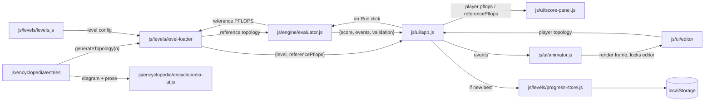

# Initial Architecture — Research

## 1. Decisions Locked In This Conversation

The four answers below shape every other decision in this document. They are settled and not up for revisiting in this feature.

- **Engine = pure function.** `Evaluator.evaluate(topology)` runs to completion synchronously and returns a `{ score, events, validation, strategy }` object. The UI is responsible for replaying the event timeline at whatever speed it likes. The engine holds no live animation state.
- **Module loading = IIFE + global namespace.** Each file is wrapped in `(function(){ ... window.DCN.<subns>.<ClassName> = <ClassName>; })()`. `index.html` lists `<script>` tags in dependency order. No build step, no bundler, no `import`/`export`, works from `file://`.
- **Run trigger = on-demand.** A "Run" button in the UI evaluates the current topology. Editing the topology after a run marks the displayed score stale until the user runs again. The engine is never invoked automatically on edit.
- **Persistence = full localStorage.** Per-level best score, star rating, the topology that achieved each best score (so it can be re-loaded), the set of unlocked encyclopedia entries, and the current level all survive a tab close.

## 2. Top-Level Layout

We respect the four `js/` directories committed to in [5-deliverables.md](../../proposal/2026-04-13-datacenter-network-gamification/5-deliverables.md):

```
index.html
js/
  engine/
  ui/
  levels/
  encyclopedia/
vendor/
  three.min.js
```

The localStorage wrapper lives under `js/levels/` rather than spawning a fifth top-level directory under `js/` — player progress is conceptually per-level state and the proposal's directory split should not be expanded on a whim.

`vendor/` is a sibling of `js/`, holding a local copy of Three.js so 3D levels can never fail due to a CDN outage and the game runs fully offline from `file://`.

## 3. Module Breakdown

Proposed files inside each directory, with a one-line job description for each. This is the table of contents we will build phases against in `3-plan.md`.

### `js/engine/` (the pure-function side)

- `prng.js` — seeded PRNG (mulberry32). One class with `next()` returning `[0, 1)`.
- `graph.js` — `Graph` class: nodes, links, adjacency, degree, BFS, Dijkstra.
- `topology.js` — `Topology` DTO + constraint validation (degree, cable length, budget, planarity).
- `event-queue.js` — binary-heap priority queue keyed by event time.
- `link.js` — `Link` model: bandwidth, latency, in-flight packet queue.
- `simulator.js` — DES kernel. Signature: `simulate(topology, schedule, seed) -> { events, completionTime }`.
- `all-reduce-ring.js` — emits the ring-strategy packet schedule for a given topology.
- `all-reduce-tree.js` — emits the tree-strategy packet schedule for a given topology.
- `bisection-bandwidth.js` — `calc(graph)` picks exact vs. spectral based on node count. `_calcExact` does brute-force partition enumeration; `_calcSpectral` computes the Fiedler value of the graph Laplacian. Threshold lives as a module-level constant `EXACT_MAX_NODES = 20`.
- `scorer.js` — graph-theoretic metrics (diameter, bottleneck identification) and the PFLOPS formula. Delegates bisection bandwidth to `bisection-bandwidth.js`.
- `evaluator.js` — top-level orchestrator: validates, runs both strategies, picks the best, returns the full result object.

### `js/ui/`

- `app.js` — root controller. Wires editor + run button + animator + score panel + level loader together.
- `editor-2d.js` — Canvas 2D editor (handles both fixed-grid and free-placement modes).
- `editor-3d.js` — Three.js editor for levels 7-8.
- `animator.js` — owns the playback head, `isPlaying`, and `playbackSpeed`. Exposes `play(events) / pause() / stop() / setSpeed(multiplier)` with preset multipliers 0.5x, 1x, 2x, 5x. Renders all events with `t <= head` onto whichever editor is active. While `isPlaying` is true, `app.js` disables the editor.
- `score-panel.js` — renders the score breakdown returned by the evaluator.
- `constraint-panel.js` — live constraint validation feedback while the user is editing.

### `js/levels/`

- `levels.js` — array of all 8 level configs in a single file (it is small).
- `level-loader.js` — loads a level into the editor and activates the level's constraints. On load, also looks up the level's `referenceEntryId`, calls that encyclopedia entry's `generateTopology(level.nodeCount)`, runs the evaluator on it once, and caches the resulting PFLOPS as `referencePflops` for star-rating computation.
- `progress-store.js` — localStorage read/write for player progress.

### `js/encyclopedia/`

```
js/encyclopedia/
  entries/
    fat-tree.js
    torus.js
    dragonfly.js
    clos.js
    jellyfish.js
    ...
  entries.js
  encyclopedia-ui.js
```

- `entries/<name>.js` — one file per topology. Each exports an object `{ id, name, paragraphs, papers, properties, generateTopology(nodeCount) }`. The `generateTopology` function is the keystone of the encyclopedia/level integration: it produces a canonical `Topology` DTO that drives both the entry's diagram in the encyclopedia UI and the level's reference PFLOPS used for star thresholds.
- `entries.js` — re-exports the array of all entries so `level-loader.js` and `encyclopedia-ui.js` can look them up by id.
- `encyclopedia-ui.js` — browser modal/panel showing prose + a Canvas-rendered diagram (drawn from `generateTopology`) + papers list. Respects which entries are unlocked.

## 4. Data-Shape Contracts

These are the interfaces between modules. Internal implementation can change freely, but these shapes are the contract.

### Topology (editor → evaluator)

```
{
    nodes: [{ id, x, y, z }, ...],
    links: [{ from, to, bandwidth, latency }, ...],
    workload: { type: 'all-reduce', payloadBytes, iterations },
    seed,
}
```

### Evaluator result (evaluator → UI)

```
{
    validation: { valid, violations: [{ constraint, message }] },
    strategy: 'ring' | 'tree',
    score: {
        pflops, starRating,
        diameter, bisectionBandwidth, bottleneckLinkId,
        completionTime, communicationOverhead,
    },
    events: [{ t, type, linkId, packetId, fromNode, toNode }, ...],   // sorted by t
}
```

### Level config

```
{
    id, name,
    nodeCount,
    editorMode: '2d-fixed' | '2d-free' | '3d',
    initialNodePositions,
    constraints: { maxDegree, maxCableLength, cableBudget, requirePlanar },
    starThresholds: { one: 0.50, two: 0.75, three: 0.95 },  // ratio of player PFLOPS to reference
    referenceEntryId,        // encyclopedia entry whose generateTopology() defines the optimal for this level
    encyclopediaUnlock,      // entry id unlocked on completion (often === referenceEntryId, may be null)
}
```

The level config no longer hard-codes absolute PFLOPS targets. Instead, the level points at an encyclopedia entry whose `generateTopology(nodeCount)` produces the canonical reference; the evaluator is run on that reference at level-load time to derive `referencePflops`, and star ratings come from the player's PFLOPS divided by that reference compared against the ratio thresholds. This automatically self-tunes if the simulation model is ever changed.

### Encyclopedia entry (engine-readable, not a DTO sent across a boundary but a stable shape nonetheless)

```
{
    id, name,
    paragraphs: [string, ...],
    papers: [{ title, authors, year, url }, ...],
    properties: { degreeFormula, diameterFormula, bisectionBandwidthFormula, realWorldUsage },
    generateTopology(nodeCount) -> Topology,
}
```

### Persistence schema

Stored under localStorage key `dcn.progress.v1`:

```
{
    version: 1,
    currentLevel,
    bestByLevel: { [levelId]: { pflops, ratio, stars, topology } },
    unlockedEntries: [entryId, ...],
}
```

`bestByLevel` records both the absolute `pflops` and the `ratio` (player / reference) that produced the star count. Storing both means that if we ever retune the reference topology generator, the historical absolute score still displays correctly even though the ratio (and therefore stars) might have shifted.

The `version` field is there so a future schema change can detect and migrate old saves rather than silently breaking them.

## 5. Data Flow

The on-demand run + replay flow:



Key properties of this flow:

- The editor is the single source of truth for the player's topology. The evaluator is stateless.
- The evaluator is invoked twice per level: once at load time on the encyclopedia entry's reference topology to set `referencePflops`, and again every time the player clicks Run.
- The evaluator runs both all-reduce strategies internally and picks the winner before returning. The UI never sees the loser's score or events.
- The animator only ever consumes a finished event timeline; it does not call back into the engine. While it is playing, the editor is locked.
- `progress-store.js` is the only module that touches `localStorage`. Everything else goes through it.
- Each encyclopedia entry's `generateTopology` is the single source of truth for both the encyclopedia's diagram and the level's optimal-PFLOPS reference.

## 6. Naming, Style, Module Conventions

- Global namespace: `window.DCN`, with sub-namespaces `DCN.engine`, `DCN.ui`, `DCN.levels`, `DCN.encyclopedia`.
- Each file ends with `window.DCN.<subns>.<ClassName> = <ClassName>;` inside its IIFE wrapper.
- Class, file, and naming conventions follow [AGENTS.md](../../../../AGENTS.md): one class per file, kebab-case filenames matching the class, `static` utility classes have no constructor, `_`-prefixed private methods, guard clauses, named intermediate variables, no destructuring, no arrow function method definitions, no `else` after a returning branch, etc.

## 7. Open Questions Resolved

The six smaller decisions raised during research, with the architectural impact each one has on the rest of this document:

- **Star thresholds** = ratio of player PFLOPS to a reference topology defined by the level's encyclopedia entry. Cascades into the level config (Section 4) and `level-loader.js` (Section 3).
- **Bisection bandwidth** = exact (brute-force partition enumeration) for `nodeCount <= 20`, spectral (Fiedler value of the graph Laplacian) for larger. Lives in the new module `js/engine/bisection-bandwidth.js` (Section 3).
- **Edit during playback** = the editor is locked while `animator.isPlaying`. Wired by `app.js` watching the animator's state (Section 3).
- **Animation controls** = play / pause / stop plus preset speed buttons (0.5x, 1x, 2x, 5x). `animator.setSpeed(multiplier)` (Section 3).
- **Encyclopedia depth** = full prose + diagram + papers per entry. Each entry is its own file under `js/encyclopedia/entries/` and owns a `generateTopology(nodeCount)` function (Sections 3 and 4).
- **Three.js loading** = vendored locally at `vendor/three.min.js`. New top-level `vendor/` directory (Section 2).

## 8. Out of Scope (Reaffirmed)

- No code in this feature. We end at an architecture document.
- No specific algorithm choices beyond what the proposal already names (Dijkstra, Boyer-Myrvold, ring/tree all-reduce).
- No UI styling or layout decisions.
